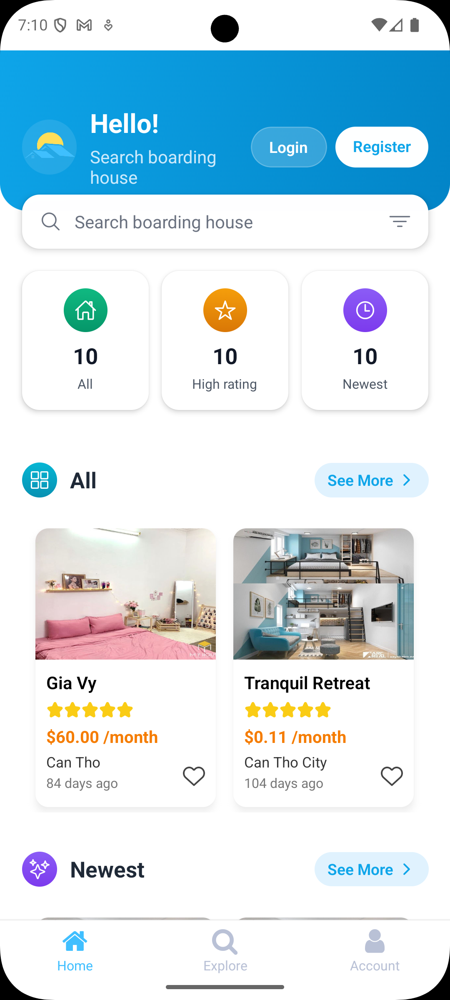
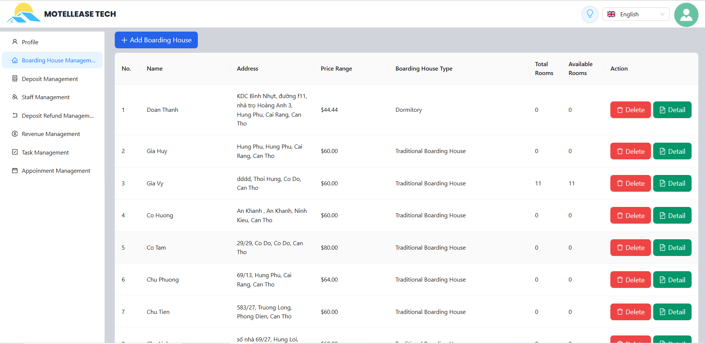

# MOTELLEASE TECH 🏠

## Introduction

**MOTELLEASE TECH** is a smart boarding house booking application developed to solve accommodation challenges for students and workers. The application helps users easily search, compare prices and facilities of boarding houses, while supporting landlords to efficiently manage their property listings and revenue.

> 🎓 **This is our graduation project - Completed with excellent grades (8+/10)**

---

## ✨ Key Features

### 👤 Tenant

- 🔍 Search and filter boarding houses by criteria
- 💰 Deposit and refund management
- 💳 Online rent payment (MoMo, VNPay)
- ⭐ View detailed room information and facilities

### 🏢 Landlord

- 📋 Manage boarding house and room listings
- 💵 Automatic monthly rent calculation
- 📊 Revenue management and statistical reports
- 👥 Assign management permissions to staff

### 👔 Staff

- 🔑 Manage boarding houses assigned by landlord
- 📝 Support operations and room management

### 🛡️ Admin

- 👨‍💼 User account management
- 🏘️ Manage all boarding houses in the system
- 🚨 Handle reports and complaints from users

---

## 🛠️ Technology Stack

### MERN Stack

- **MongoDB** - Database
- **Express.js** - Backend Framework
- **React.js** - Frontend Web
- **Node.js** - Runtime Environment

### Mobile

- **React Native** - Cross-platform Mobile App

### Additional Technologies

- **Cloudinary** - Cloud Storage for images
- **MoMo & VNPay** - Payment Gateway
- **JWT** - Authentication & Authorization

---

## 📁 Project Structure

```
Boarding-house-booking/
├── backend/          # Server API (Express.js + MongoDB)
├── website/          # Web Application (React.js)
├── mobile/           # Mobile Application (React Native)
├── dashboard/        # Admin Dashboard (React.js)
└── images/          # Project Screenshots
    ├── mobile.png
    └── laptop.png
```

---

## 🚀 Installation Guide

### System Requirements

- Node.js (v18.x or higher)
- MongoDB (Local)
- npm or yarn
- React Native CLI
- Android Studio / Xcode (for mobile development)

### Installation Steps

1. **Clone repository**

```bash
git clone <repository-url>
cd Boarding-house-booking
```

2. **Install dependencies for all modules**

```bash
npm install
```

3. **Install dependencies for each module separately**

```bash
# Backend
cd backend
npm install

# Website
cd ../website
npm install

# Mobile
cd ../mobile
npm install

# Dashboard
cd ../dashboard
npm install
```

4. **Return to root directory and start**

```bash
# run web version
cd ..
npm start

# run mobile
cd mobile
npm start
```

---

## 📱 Screenshots

### Mobile Application



### Web Application



---

## 👥 Team Members

| Role            | Member                    |
| --------------- | ------------------------- |
| **Team Leader** | PhucDT                    |
| **Members**     | YTDH, TienDM, DuyNT, VyGT |

---

<div align="center">
  <strong>⭐ If you find this project useful, please give us a star! ⭐</strong>
</div>
